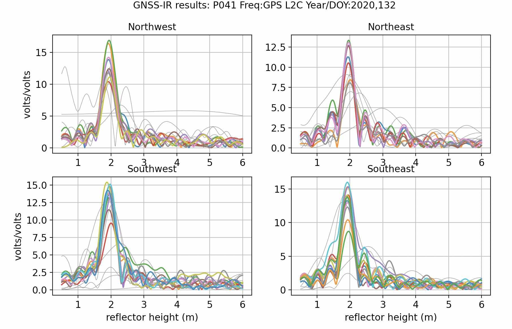
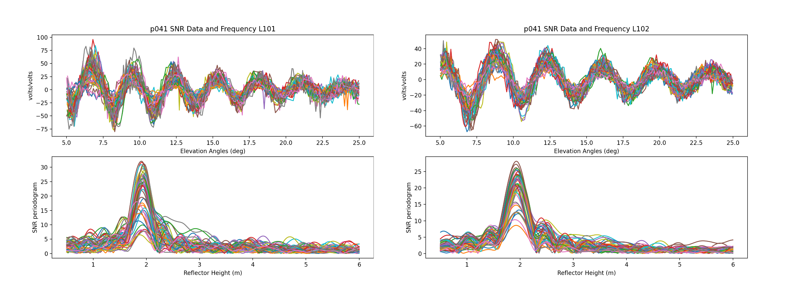
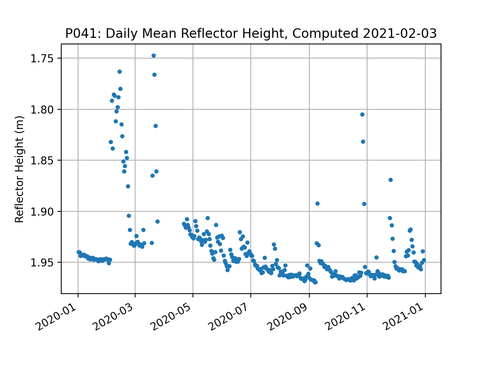

### Marshall, Colorado, USA

**Station Name:** p041 

**Location:** Boulder, CO, USA

**Archive:** [UNAVCO](http://www.unavco.org), [SOPAC](http://sopac-csrc.ucsd.edu/index.php/sopac/) 

**DOI:**  	[https://doi.org/10.7283/T5R49NQQ](https://doi.org/10.7283/T5R49NQQ)

**Ellipsoidal Coordinates:**

- Latitude: 39.94949

- Longitude: -105.19427

- Height: 1728.842 m

[Station Page at UNAVCO](https://www.unavco.org/instrumentation/networks/status/nota/overview/P041)

[Station Page at Nevada Geodetic Laboratory](http://geodesy.unr.edu/NGLStationPages/stations/P041.sta)

[Google Map Link](https://goo.gl/maps/GwGV8PS4CQVQzYHC7) 

## Data Summary

The p041 antenna is ~2 meters above the soil surface. It is located at Marshall Mesa, Colorado.
The site is relatively planar and free of obstructions. Since October 2018 the site has 
recorded multi-GNSS signals. Marshall Mesa has been featured in multiple publications on GNSS-IR:

* [Use of GPS Receivers as a Soil Moisture Network for Water Cycle Studies (2008)](https://www.kristinelarson.net/wp-content/uploads/2015/10/larson_soil_grl2008.pdf)

* [Can We Measure Snow Depth with GPS Receivers (2009)](https://www.kristinelarson.net/wp-content/uploads/2015/10/larsonetal_snow_2009.pdf) 

* [Sensing Vegetation Growth with Reflected GPS Signals (2010)](https://www.kristinelarson.net/wp-content/uploads/2015/10/small_etal_2010.pdf) 

To get a sense of whether an azimuth or elevation mask is appropriate, 
check the [Reflection Zone Mapping in the web app](https://gnss-reflections.org/rzones?station=p041&lat=39.9495&lon=-105.1943&height=1728.842&msl=on&RH=2&eang=2&azim1=0&azim2=360).  
In the linked page, the reflection zones from 5 to 25 degree elevation angles are plotted as 
colored ellipses surrounding the station.  

##Reproduce the Web App ##

p041 is one of the example cases for the [GNSS-IR webapp.](https://gnss-reflections.org/api?example=p041) 
You can see from the title of the plot that the web app reproduces 
results for the year 2019, day of year 150, and L1 frequency. You can make something that looks similar
to this using these commands:

<code>rinex2snr p041 2019 150</code>

and

<code>quickLook p041 2019 150</code>

##Take a Quick Look at the Data##

First make a SNR file:

<code>rinex2snr p041 2020 132</code>

Then use **quickLook** to analyze the reflection characteristics of the site [(For details on quickLook output)](../../docs/quickLook_desc.md).

The default return is for the L1 frequency:

<code>quickLook p041 2020 132</code>

Now try looking at the periodogram for L2C:

<code>quickLook p041 2020 132 -fr 20</code>

Note that there are more colors in the L1 plots than in the L2C plots. That is the result of 
the fact that there are more L1 satellites than L2C satellites.

Now try L5:

<CODE>quickLook p041 2020 132 -fr 5</code>

The L5 signal has only been available on satellites launched after 2010, so there are 
fewer satellite tracks than either L1 or L2C.

The **quickLook** code has multiple options. For example, it is possible change the reflector height range:

<code>quickLook p041 2020 132 -h1 0.5 -h2 10</code>

To look at Glonass and Galileo signals, the SNR files must be created using the -orb gnss flag.
If you have already made a file using only the GPS data, you will need the overwrite flag.

<code>rinex2snr p041 2020 132 -orb gnss -overwrite True</code>

Beidou signals are tracked at this site, but unfortunately the data are not available in the RINEX 2.11 file.
They are very likely available in the RINEX 3 file, so you are encouraged to look there.

**quickLook** is meant to be a visual assessment of the spectral characteristics at a given site on a given day.  
For routine analysis, one must use **gnssir**.

## Analyze the Data

You can start by setting up the analysis parameters. These are stored 
in a json file. In this case, the p041 RINEX data are multi-gnss, so set 
the options to allow all frequencies from all constellations:

*make_json_input p041 39.94949 -105.19427 1728.842 -allfreq True -e1 5 -e2 25*

Because the site is fairly planar, the parameters can be left at default settings. The elevation 
angles for the SNR data are set to minimum and maximum values of 5 and 25 degrees, respectively. 
The json output will be stored in $REFL_CODE/input/p041.json. [Here is a sample json file](p041.json).

Then run **rnx2snr** to obtain the SNR values for the year 2020.  In this case, the 
p041 RINEX data are multi-gnss, so the orbit flag is set to allow all available constellations:

<code>rinex2snr p041 2020 1 -doy_end 365 -orb gnss</code>

The output SNR files are stored in $REFL_CODE/2020/snr/p041. Once the SNR values are available, run **gnssir** for an entire snow season.

<code>gnssir p041 2020 1 -doy_end 365</code>

The daily output files for **gnssir** are stored in $REFL_CODE/2020/results/p041. [Here are the results for a single day](024.txt). There is an option to produce plots:
 
<code>gnssir p041 2020 24 -plt True</code>

Typically a daily average is used by most scientists. To ensure the average is 
meaningful and not impacted by large outliers, 
minimal quality control values are used, a median filter (meters) and minimum number 
of tracks per day. Here a median filter of 0.25 meter is used and 50 tracks are required.  

<code>daily_avg p041 .25 50 -txtfile p041-dailyavg.txt</code>

[Example daily average RH file](p041-dailyavg.txt).

Plots are also provided: 

The changes in reflector height in January-April and September-December are consistent with snow accumulation.
We will be comparing to validation data later. The changes in the summer are related to soil moisture changes.

