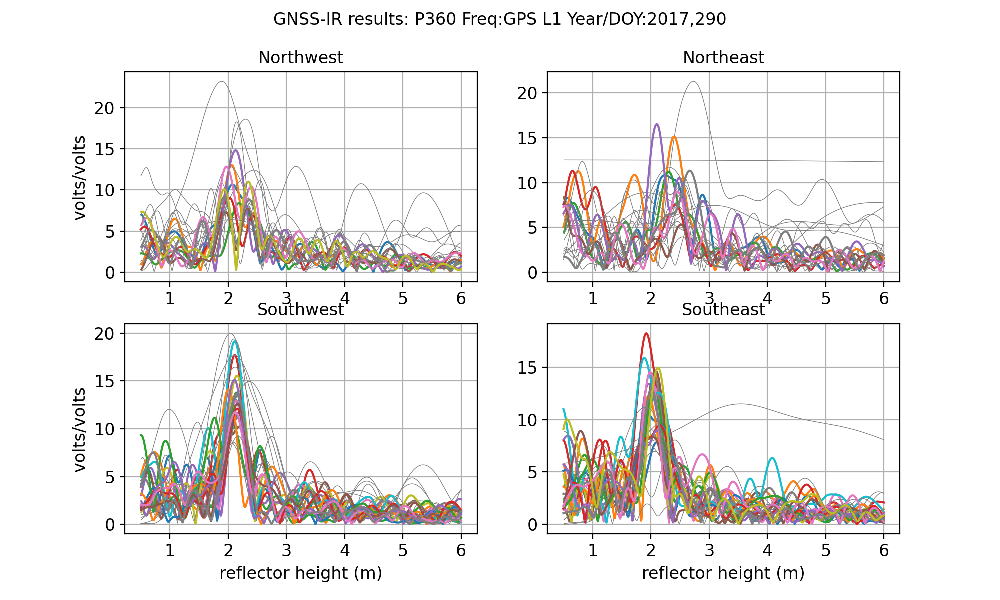

### Island Park, Idaho
  
**Station Name:**  p360

**Location:**  Island Park, Idaho

**Archive:**  [UNAVCO](http://www.unavco.org), [SOPAC](http://sopac-csrc.ucsd.edu/index.php/sopac/)

**DOI:**  [https://doi.org/10.7283/T5DB7ZR3](https://doi.org/10.7283/T5DB7ZR3)

**Ellipsoidal Coordinates:**

- Latitude:  44.31785

- Longitude: -111.45068

- Height:       1857.861 m

[Station Page at UNAVCO](https://www.unavco.org/instrumentation/networks/status/nota/overview/P360)

[Station Page at Nevada Geodetic Laboratory](http://geodesy.unr.edu/NGLStationPages/stations/P360.sta)

[Station Page at PBO H2O](http://cires1.colorado.edu/portal/index.php?product=snow&station=p360)

[Google Map Link](https://goo.gl/maps/EcTkbHjaSaWp4d8H9)

## Data Summary

Station p360 is located to the west of Yellowstone National Park, near the town of Island Park 
in Idaho.  At an elevation of ~1858 m, winter snowfall can be frequent and heavy.

The site has been recording multi-GNSS data since March 2020.

The station is in a flat, grassy plain with no obstacles or changes in topography, so elevation and azimuth 
masks are not particularly required.  

P360 was part of [PBO H2O](http://cires1.colorado.edu/portal/)

## Take a Quick Look at the Data

Make an SNR file. Use the special archive to allow access to L2C data.

<CODE>rinex2snr p360 2017 290 -archive special</code>

<code>quickLook p360 2017 290</code>

And for L2C:

## Analyze the Data

Set the analysis paramaters using **make_json_input**. This analysis will use the L2C frequency.  

<code>make_json_input p360 44.31785 -111.45068 1857.861 -l2c True</code>

<code>rinex2snr p360 2017 245 -doy_end 365 -archive special</code>

<code>rinex2snr p360 2018 1 -doy_end 150 -archive special</code>

Output SNR values are stored in $REFL_CODE/$year/snr/p360, where $year = 2017 or 2018.

Then run **gnssir** to calculate the reflector heights for 2017/208

<code>gnssir p360 2017 1 -year_end 2018 -doy_end 366</code>

<code>daily_avg p360 0.25 12 </code>

The first plot shows the number of reflector heights each day. This plot can be 
used to fine-tune the minimum number of reflector heights for the **daily_avg** command.

