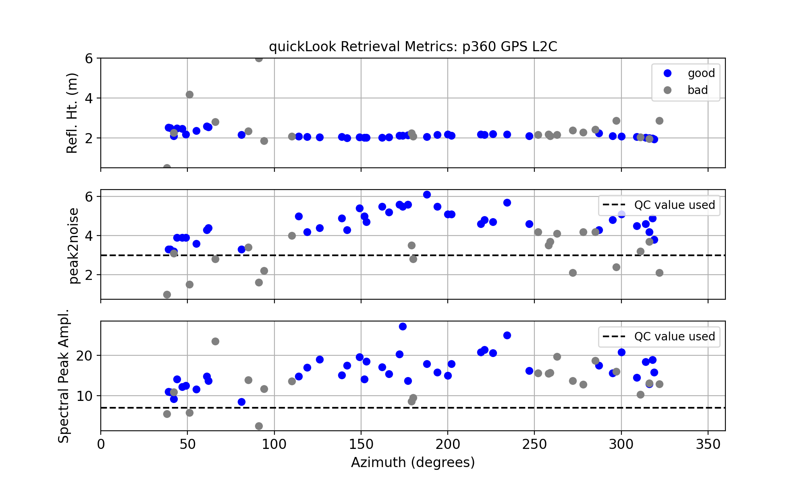

### Island Park, Idaho
  
**Station Name:**  p360

**Location:**  Island Park, Idaho

**Archive:**  [UNAVCO](http://www.unavco.org)

**DOI:**  [https://doi.org/10.7283/T5DB7ZR3](https://doi.org/10.7283/T5DB7ZR3)

**Ellipsoidal Coordinates:**

- Latitude:  44.31785

- Longitude: -111.45068

- Height: 1857.861 m

[Station Page at UNAVCO](https://www.unavco.org/instrumentation/networks/status/nota/overview/P360)

[Station Page at Nevada Geodetic Laboratory](http://geodesy.unr.edu/NGLStationPages/stations/P360.sta)

[Station Page at PBO H2O](http://cires1.colorado.edu/portal/index.php?product=snow&station=p360)

[Google Map Link](https://goo.gl/maps/EcTkbHjaSaWp4d8H9)

## Data Summary

Station p360 is located to the west of Yellowstone National Park. At an elevation of ~1858 m, 
winter snowfall can be frequent and heavy.
The site has been recording multi-GNSS data since March 2020. Before that time, only 
the L2C GPS data are of reliable quality. p360 was part of [PBO H2O](http://cires1.colorado.edu/portal/)

The station is in a flat, grassy plain with no obstacles or changes in topography, so complicated elevation and azimuth 
angle masks are not required.  

## Take a Quick Look at the Data

Make an SNR file. Use the *special* archive to allow access to L2C data:

<CODE>rinex2snr p360 2017 290 -archive special</code>

and then

<code>quickLook p360 2017 290</code>

The default return is for L1. This plot confirms our concerns about the quality of the L1 data.
It also suggests the southern quadrants are preferred to other quadrants.

And for L2C:

<code>quickLook p360 2017 290 -fr 20</code>

These reflector height retrievals are far superior to the L1 data. The southern quadrants give more 
consistent retrievals than for the north. This is confirmed in the QC plot show here:

## Analyze the Data

First we will set the analysis paramaters using **make_json_input**. This analysis will use the L2C frequency and 
will use QC metrics derived from the previous plot (for peak to noise ratio and amplitude).  

<code>make_json_input p360 44.31785 -111.45068 1857.861 -l2c True -peak2noise 3.2 -ampl 8 </code>

We will hand edit the json file to disallow 0-90 degrees in azimuth. [Sample json file](p360.json)

We then make SNR files to encompass one water year:

<code>rinex2snr p360 2017 245 -doy_end 365 -archive special</code>

<code>rinex2snr p360 2018 1 -doy_end 145 -archive special</code>

SNR files are stored in $REFL_CODE/$year/snr/p360, where $year = 2017 or 2018.

Then we run **gnssir** to calculate the reflector heights for 2017/2018. Because the code
only creates results if the SNR file exists, we can use the year_end and doy_end settings.

<code>gnssir p360 2017 1 -year_end 2018 -doy_end 366</code>

## Derive Snow Accumulation from Reflector Heights

Use the **daily_avg** utility with a relatively low number of required satellite tracks (12) 
and 0.25 meter median filter to remove large outliers:

<code>daily_avg p360 0.25 12 </code>

Here all RH retrievals are shown:

This plot makes it clear that there are data outages at p360, particular in the winter months.
This is due to the way the site was built. Power was provided by solar panels and batteries. When
snow covered the solar panels (see the photograph above), the site would soon lose power when 
the batteries ran down. When the snow on the panels melted, the site would track again.

This next plot shows the number of reflector heights each day. While they are consistent 
in the fall and later spring, there is significant variation in December, January, and February.

The variation in retrievals in the winter is due to poor data retrieval in those winter months. 
This next plot shows the number of total observations in the RINEX file each day. You can see the 
correlation between the number of tracks available for the daily average and the number of 
observations in the file. For sites with more reliable power, there will not be 
data outages during the winter.

Finally, the daily average RH for the water year: 

[Sample daily average RH output](p360_dailyRH.txt)
