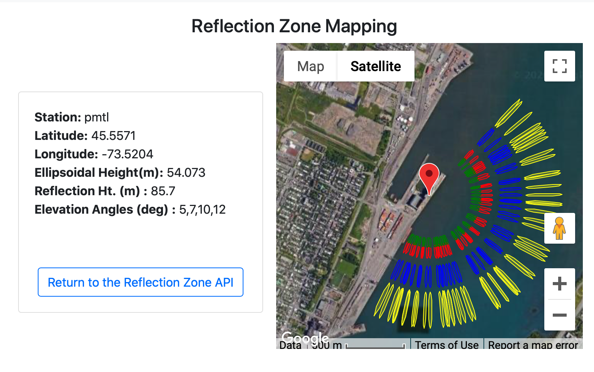

### St Lawrence River

**Station Name:** 	pmtl

**Location:** Port de Montreal, Montreal, Canada

**Archive:**  [NRCAN](https://www.nrcan.gc.ca/home)

**Ellipsoidal Coordinates:**

- Latitude: 45.557

- Longitude: -73.520

- Height: 54.073 m

[Station Page at Natural Resources Canada](https://webapp.geod.nrcan.gc.ca/geod/data-donnees/station/report-rapport.php?id=M0722900)

[Station Page at Nevada Geodetic Laboratory](http://geodesy.unr.edu/NGLStationPages/stations/PMTL.sta)

[Google Map Link](https://goo.gl/maps/FoJ68HDT2KZ6KnZc7)

### Data Summary

Station PMTL is located on the Viterra Montreal Terminal building ad the Port de Montreal in 
Montreal, Canada.  It is operated by the Montreal Port Authority.

GPS L1 and Glonass L1 and L2 can be used for this site. Since the site is more than 60 meters above the water, you need to use
high-rate GNSS data. Because of the awy that NRCAN stores these data, this means you need to have installed <code>teqc</code>.

Note the [ellipsoidal height and geoid corrected height](https://gnss-reflections.org/geoid?station=pmtl)

To pick an azimuth and elevation mask, try the [reflection zone webapp](https://gnss-reflections.org/rzones).

### quickLook

Make a SNR file for multi-GNSS and high-rate:

<code>rinex2snr pmtl 2020 330 -archive nrcan -rate high -orb gnss</code>

<code>quickLook pmtl 2020 330 -h1 60 -h2 90 -e1 5 -e2 12</code>

I have annotated this <code>quickLook</code> periodogram to point out that there is an outlier in the SW region. 
You can also see that the NW region is useless, which is what we should expect.
You can try looking at a few more frequencies (such as Glonass) and using a more restricted RH region.

### Analyze the Data

Set up analysis instructions 

<code>make_json_input pmtl 45.5571 -73.5204 54.073 -h1 70 -h2 90 -e1 5 -e2 12 -allfreq True</code>

Hand-edit the json to remove GPS L2C, GPS L5, and Galileo data, and 
to set your azimuth region. [Here is my json that you can compare to](pmtl.json).

<code>rinex2snr pmtl 2020 270 -doy_end 300 -archive nrcan -rate high -orb gnss</code>

<code>gnssir pmtl 2020 270 -doy_end 300</code>

The Canadian Hydrographic Service within Fisheries and Ocean Canada operates tide gauges along the St Lawrence 
River, the closest of which is Montreal Jetee #1 (station 15520), about 1 km south of the GNSS site. 
Tide data can be [downloaded](https://www.isdm-gdsi.gc.ca/isdm-gdsi/twl-mne/inventory-inventaire/interval-intervalle-eng.asp?user=isdm-gdsi&region=PAC&tst=1&no=15520). Use the daily mean water level when submitting a request and download the resulting csv file. 
For this use case, the tidal data have already been [downloaded](15520-26-SEP-2020_slev.csv).

