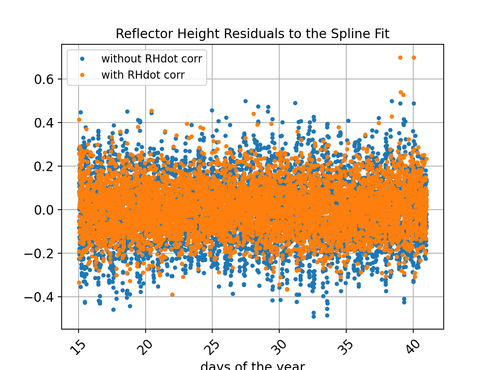

### Friday Harbor

**Station Name:** sc02

**Location:** Friday Harbor, Washington, USA 

**Archive:** [UNAVCO](http://www.unavco.org)

**Ellipsoidal Coordinates:**

- Latitude: 48.546

- Longitude: -123.008  

- Height: -15.049 m

[Station Page at UNAVCO](https://www.unavco.org/instrumentation/networks/status/nota/overview/SC02)

[Station Page at Nevada Geodetic Laboratory](http://geodesy.unr.edu/NGLStationPages/stations/SC02.sta)

### Data Summary

There have been *a lot* of papers written about sc02. That being said, it is not an ideal site. It is set 
back a bit too far from the shore - and would have been far superior for reflections if the antenna were
a bit taller. Furthermore, there are obstructions (docks). For further details, you are encouraged to read 
[this early paper](https://www.kristinelarson.net/wp-content/uploads/2015/12/LarsonRayWilliams-2017-FridayHarbor.pdf) 
summarizing a comparison of 10 years of GNSS-IR results with the colocated tide gauge operated by NOAA. That paper only
used the GPS L1 SNR data.  Since that time a multi-GNSS receiver has been operating and there is an order of 
magnitude increase in the number of useable signals. We will only use the data from this new receiver.
Although there are 1-sec data archived at UNAVCO, for this small study we will use the 15 second files.

Take some time to look at the [reflection zones webapp.](https://gnss-reflections.org/rzones?station=sc02) 

### Take a quick look at the SNR data

Translate the GPS data for January 15 2021. First you need to make the SNR file:

<code>rinex2snr sc02 2021 15</code>

Use our utility **quickLook** with defaults [(For more details on quickLook output)](../../docs/quickLook_desc.md):

<code>quickLook sc02 2021 15 </code>

These results for reflector height are pretty bad (gray means the retrieval does not pass QC). Why? 
The reflector height defaults are restricted to 0.5-6 meters, which includes part of 
the tidal range, but not all of it. Furthermore, the default elevation angles of 5 to 25 degrees are 
not acceptable here, as they include rocks and soil in addition to the water.

Now let's make better choices. Following the suggestions of *Larson, Ray, and Williams* (2017), use 
elevation angle restrictions of 5 to 13 degrees and reflector height restrictions of 3 to 10 meters. And let's 
use a modern GPS signal, L2C.

<code>quickLook sc02 2021 15 -e1 5 -e2 13 -h1 3 -h2 12 -fr 20</code>

Now instead of vast numbers of unsuccessful reflector height retrivals, you can begin to 
see where the acceptable azimuths will be, ~50 to 230 degrees. Peak to noise of 3 works pretty well.
The Lomb Scargle periodograms show the retrievals in periodogram space. You can see here that the northwest
is a dead zone for water reflections, but this is what you should expect if you 
[look at google maps](https://gnss-reflections.org/geoid?station=sc02):

We can also check the retrievals stats for L1 to make sure these look good too.

### Measure Tides 

We will not attempt to analyze a long time series, but instead focus here on the process. We will be 
using ~two weeks of GNSS data from 2021 as our sample dataset.

<code>rinex2snr sc02 2021 15 -doy_end 40</code>

Then you need to make the list of analysis inputs (stored in json format):

<code>make_json_input sc02  48.546  -123.008  -15.049 -e1 5 -e2 13 -h1 3 -h2 12 -peak2noise 3.0 -allfreq True</code>

Hand edit the json file to remove the unreliable azimuths and the Beidou signals because they are 
not in the RINEX 2.11 file [Example json file](sc02.json). 

Once you have the json file set up, you can analyze the data:

<code>gnssir sc02 2021 15 -doy_end 40</code>

This produces reflector heights for every rising and setting satellite track that meets the 
quality control metrics that you set. We have some preliminary code that will help you evaluate 
these retrievals. It is a work in progress, so it does not do everything yet. I am going to start
by concatenating the results and applying a 3 sigma outlier criterion using 0.12 meters as the standard deviation.

<code>subdaily sc02 2021 -outlier 0.36</code>

This will also create and apply the RH dot correction. The outliers are identified and removed
from the output file.

