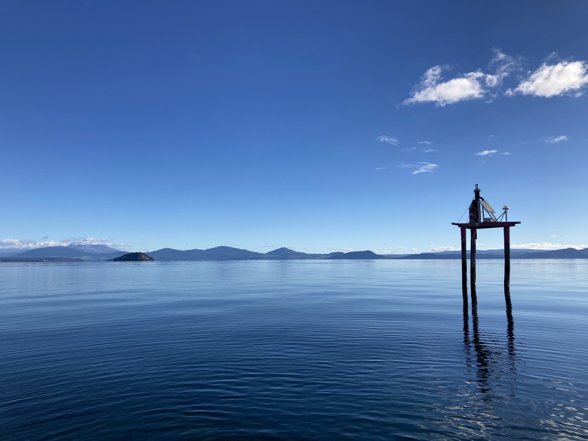
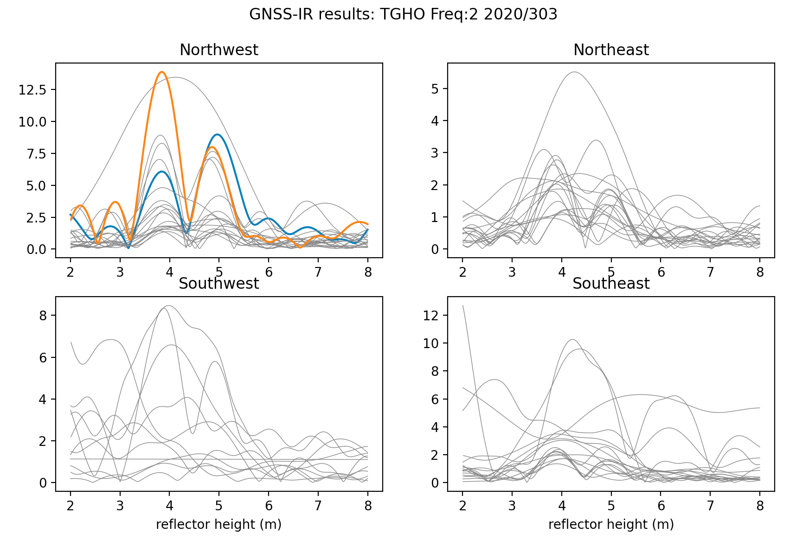
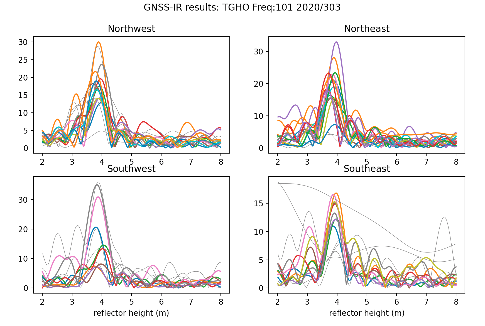
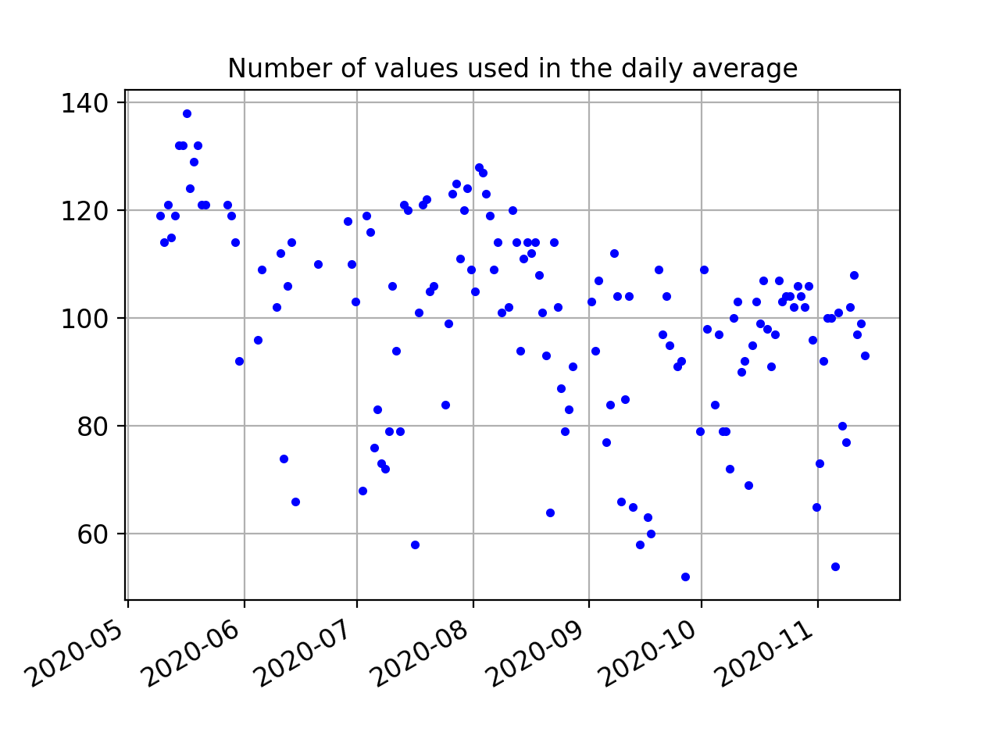
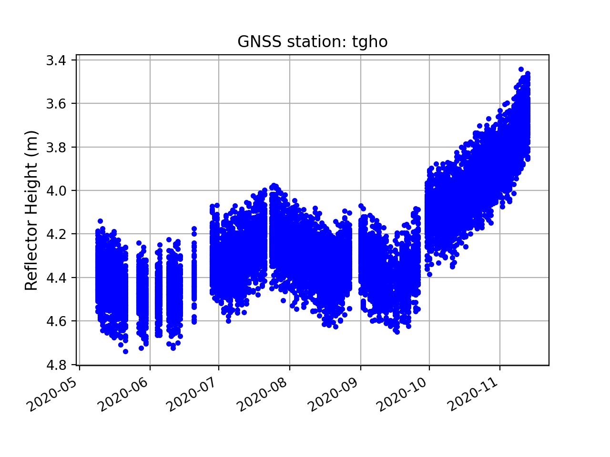

### Lake Taupo, New Zealand

**Station Name:** tgho 

**Location:** Lake Taupo, North Island

**Archive:** [Geonet](https://www.geonet.org.nz/)

**DOI:**  	N/A

**Ellipsoidal Coordinates:**

- Latitude: -38.813

- Longitude: 175.996

- Height: -38.813 m

[Station Page at Geonet](https://www.geonet.org.nz/data/network/mark/TGHO)

[Station Page at Nevada Geodetic Laboratory](http://geodesy.unr.edu/NGLStationPages/stations/TGHO.sta)

[Google Map Link](https://goo.gl/maps/1zmgi6rRHPVPDAfV8)

Photo credit: Simon Barker

### Data Summary

Station tgho is operated by GNS. It is located 
on a platform in Lake Taupo. It records standard GPS and Glonass signals at a low sample rate (30 sec).
The site could be significantly improved with a modern receiver that tracks new signals at a higher sample rate.

### Take a Quick Look at the Data

Begin by making an SNR file. Use both GPS and Glonass and set the archive to Geonet:

<code>rinex2snr tgho 2020 300 -orb gnss -archive nz</code>

<code>quickLook tgho 2020 300 -e1 5 -e2 15</code>

The clutter near the monument produces noise at the small RH values.  A better result 
can be found if those values are eliminated by setting h1 to 2. We also extend h2 to 8.

<code>quickLook tgho 2020 300 -e1 5 -e2 15 -h1 2 -h2 8</code>

Now try looking at the periodogram for L2:

<code>quickLook tgho 2020 300 -e1 5 -e2 15 -h1 2 -h2 8 -fr 2</code>

These results are not very compelling, and the GPS L2 data will not be used in subsequent analysis.  Next, try the two Glonass frequencies:

<CODE>quickLook tgho 2020 300 -e1 5 -e2 15 -h1 2 -h2 8 -fr 101</code>

<code>quickLook tgho 2020 300 -e1 5 -e2 15 -h1 2 -h2 8 -fr 102</code>

The QC metrics from Glonass 101 are helpful for setting the azimuth mask:

We will exclude 135-225 degrees in azimuth. We will require an amplitude of 9 and a peak to noise ratio of 3.0.

### Analyze the Data

Use **make_json_input** to set up the analysis parameters. 
Set the elevation and reflector heights as in **quickLook**. The peak to noise ratio and required 
amplitude can be set on the command line. 

<code>make_json_input tgho -38.8130   175.9960  385.990 -h1 2 -h2 8 -e1 5 -e2 15 -peak2noise 3 -ampl 9</code>
 
The azimuth mask was set by hand to exclude empty regions and azimiths with poor retrievals. 
Glonass signals (frequencies 101 and 102) were added and GPS L2/L5 were removed.[Sample json](tgho.json)

Then run **rnx2snr** for ~six months:

<code>rinex2snr tgho 2020 130 -archive nz -doy_end 319 -orb gnss</code>

The output SNR files are stored in $REFL_CODE/2020/snr/tgho.

Now run **gnssir** for these same dates:

<code>gnssir tgho 2020 130 -doy_end 319 </code>

To look at daily averages, use the utility **daily_avg**. The median filter is set to allow values within 0.25 meters of the 
median, and the minimum number of tracks required to calculate the average is set to 50 tracks.  

<CODE>daily_avg tgho .25 50 </code>

The number of retrievals each day is show here:

All retrievals are shown here:

Note in particular that there are quite a few data outages in this series, which means the RINEX files were missing 
from the NZ archive.

Finally, the average RH plot:

[Sample RH file](tgho_dailyRH.txt)

Although Taupo is in a volcanic caldera, lake levels are determined by seasonal processes such 
as evaporation, precipitation, input from local drainages, and outflow. The Waikoto 
River is sole river draining the lake, and river flow is regulated by a series of hydroelectric dams.

