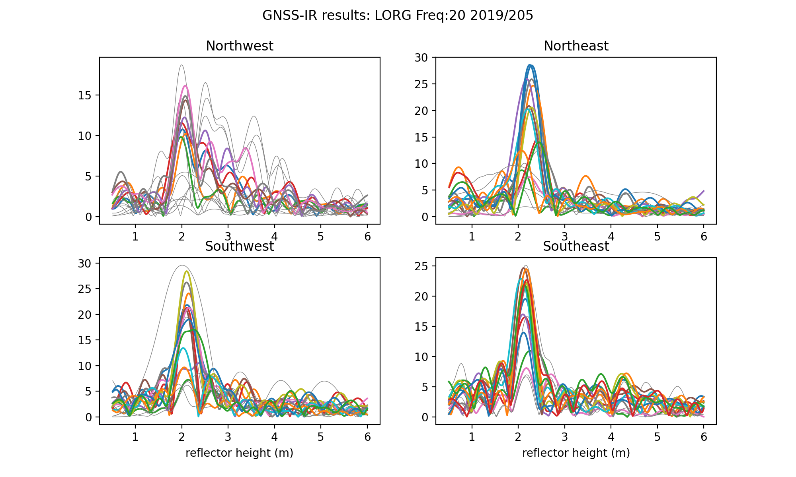

### Use Case for Ross Ice Shelf, Antarctica

**Station Name:**  lorg

**Location:**  Ross Ice Shelf, Antarctica

**Archive:**  [UNAVCO](http://www.unavco.org), [SOPAC](http://sopac-csrc.ucsd.edu/index.php/sopac/)

**DOI:**  [https://doi.org/10.7283/ACF6-YT23](https://doi.org/10.7283/ACF6-YT23)

**Ellipsoidal Coordinates:**

- Latitude:  -78.18365
- Longitude: 170.03361
- Height:  	-7.778 m

[Station Page at UNAVCO](https://www.unavco.org/instrumentation/networks/status/nota/overview/lorg)

[Station Page at Nevada Geodetic Laboratory](http://geodesy.unr.edu/NGLStationPages/stations/LORG.sta)

[Google Maps Link](https://goo.gl/maps/bSAuLXLLMmzWqPdW9). 

## Data Summary

Station lorg is on the Ross Ice Shelf, Antarctica.
The site is a largely featureless ice plain with no obstructions (see photo above). 
The site was installed on November 27, 2018 and decommissioned and removed on November 15, 2019. 
It recorded only GPS frequencies during its operation. 

## Web App

LORG is an example station on the web app for the Ross Ice Shelf. [Please note that the app will be analyzing data in 
real-time, so it will take 5-10 seconds for the periodogram to appear on the left side of the page](https://gnss-reflections.org/fancy6?example=lorg). The web app will return a photograph, station coordinates, a Google Earth Map, and a sample periodogram. The periodogram plots the reflector height (RH) in four quadrants (NW, NE, SW, SE), allowing the reflection characteristics and quality of the site to be inferred. For example, variations in topography or buildings blocking the reflections would all affect the periodograms.

**Setting Elevation and Azimuth Masks**

There are no significant topographic features near the station, so it is recommended to use default values 
for the elevation mask. An azimuth mask is not required.

## Reproduce the Web App

**Make SNR File**

Start by downloading the RINEX file and extracting the GPS SNR data:

*rinex2snr lorg 2019 205*

**Take a Quick Look at the Data**

Use **quickLook** to produce a periodogram similar to the one in the web app. The periodogram  is set to use the L1 frequency by default.

*quickLook lorg 2019 205*

 
Compare the periodograms for frequencies 1, 20 (L2C) and 5. They should be similar to the L1 periodogram, except that there will be fewer satellite traces because only GPS satellites launched after 2005 broadcast L2C and only satellites after 2010 broadcast L5.

*quickLook lorg 2019 205 -fr 20*

*quickLook lorg 2019 205 -fr 5*

## Analyze the Data

Now prepare to run **gnssir**. This code saves the daily RH output, allowing the change in reflector height at different times to be determined.

First a set of file instructions is generated. The default settings only
need the station name, lat, lon, and ht. Make this file using **make_json_input**, setting the minimum and maximum elevation flags to 5 and 25 degrees respectively.
The json output will be stored in $REFL_CODE/input/lorg.json.  [Here is a sample json file.](lorg.json)

*make_json_input -e1 5 -e2 25 lorg -78.18365 170.03361 -7.778*

Next make some snr files for a time span of about eight months. 
Restrict the search to the UNAVCO archive to make the code run faster (otherwise it will check four archives). The resulting SNR files will be stored in $REFL_CODE/2019/snr/lorg. 

*rinex2snr lorg 2019 1 -doy_end 233 -archive unavco*

Run **gnssir** for all the SNR files from **rinex2snr**.

*gnssir lorg 2019 1 -doy_end 233*

The code will print to the screen an overview of the estimated reflector heights for each satellite. These statistics can be turned off by manually editing the json file (screenstats) or changing the screenstats flag in the command line:

*gnssir lorg 2019 1 -doy_end 233 -screenstats False*

The default does not send any plots to the screen - and plotting the periodograms for 233 days of data is not recommended. Plotting the results for a single day will only produce a periodogram for each GPS frequency, and this option can be used to check the results.  Plots can be enabled in the json file or at the command line:

*gnssir lorg 2019 1 -screenstats False -plt True* 

Unlike **quickLook**, **gnssir** plots the periodograms for each frequency with no quadrants. To see the next frequency, close the current plot.

These results can be improved by eliminating various azimuths and requiring stronger 
peaks in the periodograms. The results for a single day are stored in a folder for that year, i.e. 
$REFL_CODE/2019/results/lorg. [Here is a sample for day of year 102.](102.txt).

The **daily_avg** command will calculate the daily average reflector height from the daily output files. 
To minimize outliers in these daily averages, a median filter is set to allow 
values within 0.25 meters of the median and the required minimum number of daily satellite 
tracks is set to 50.  

*daily_avg lorg 0.25 50 -txtfile lorg-dailyavg.txt*

[The daily average file is linked here.](lorg-dailyavg.txt). The first plot includes all the data,  while the 
the second has the daily averages.

